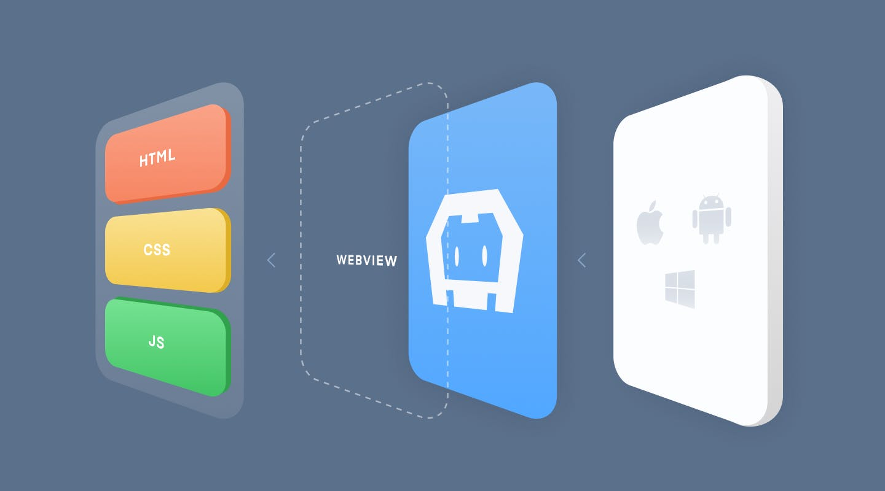
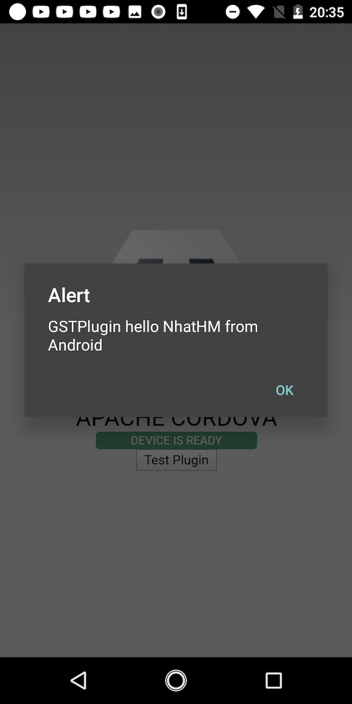

# Hướng dẫn tạo plugin cho dự án Cordova/Ionic

## Table of contents

- [Tại sao cần tạo plugin cho Cordova](#tại-sao-cần-tạo-plugin-cho-cordova)
- [Tạo plugin bằng plugman](#Tạo-plugin-bằng-plugman)
- [Hoàn thiện plugin](#Hoàn-thiện-plugin)

## Tại sao cần tạo plugin cho Cordova

- Về cơ bản, thì Cordova là framework phát triển các app iOS/Android (là chính) sử dụng html/js/css làm UI, và các bộ plugin làm cầu nối để call xuống source native của platform (iOS/Android)

- Cordova bao gồm:

  - Bộ html/js/css làm UI.
  - Native webview engine làm bộ render hiển thị UI
  - Cordova framework chịu trách nhiệm cầu nối giữa function call js và funtion native.
  - Source code native làm plugin cùng các config và các pulic js method.



- Bình thường đối với người làm Cordova thì chủ yếu họ sẽ focus vào tầng UI bằng html/js/css. Việc sử dụng các chức năng native của platform thì sẽ sử dụng các plugin được cung cấp sẵn. Vậy nên về cơ bản, một lập trình viên làm Cordova chỉ cần làm được html/js/css là đủ.
- Tuy nhiên trong một số trường hợp, các plugin có sẵn không đảm bảo giải quyết được vấn đề bài toán, lúc này việc phát triển riêng một plugin thực hiện được logic của project và support được các platform là điều cần phải làm.
- Trong một vài trường hợp, có thể dự án đã có sẵn source native, tuy nhiên cần chuyển sang Cordova để support multi platform và tận dụng source code native có sẵn.

-> Đo đó, hiểu biết về cách tạo một plugin để giải quyết nhu câu bài toán sẽ nảy sinh. Bài viết này sẽ tập trung vào việc

- Làm thế nào để tạo plugin
- Luồng xử lý từ js xuống native source của plugin như nào
- Install plugin vào Cordova project
- Build và test plugin trên iOS và Androd

## Tạo plugin bằng plugman

### Tạo Cordova project

- Để tạo Cordova plugin sample thì trước tiên cần có một Cordova project để test việc add plugin và kiểm tra hoạt động của plugin trên từng platform.

  - Install Cordova CLI: **sudo npm install -g cordova**
  - Create Cordova project: **cordova create SamplePlugin com.nhathm.samplePlugin SamplePlugin**

### Install plugman và tạo plugin template

- *plugman* là command line tool để tạo Apache Cordova plugin. Install bằng command: **npm install -g plugman**
- Create plugin
  - Command: **plugman create --name pluginName --plugin_id pluginID --plugin_version version**
  - Ví dụ: **plugman create --name GSTPlugin --plugin_id cordova-plugin-gstplugin --plugin_version 0.0.1**

- Thêm platform mà plugin sẽ hỗ trợ:
  - **plugman platform add --platform_name android**
  - **plugman platform add --platform_name ios**

- Sau khi cài đặt xong thì thư mục plugin sẽ có struct như dưới.

  ```xml
  .
  └── GSTPlugin
      ├── plugin.xml
      ├── src
      │   ├── android
      │   │   └── GSTPlugin.java
      │   └── ios
      │       └── GSTPlugin.m
      └── www
          └── GSTPlugin.js
  ```

- Ở đây, plugin.xml là file config cho plugin, bao gồm các thông tin như tên của plugin, các file assets, resources. Define jsmodule như file js module của plugin, define namespace của plugin, define các plugin phụ thuộc của plugin đang phát triển...

## Hoàn thiện plugin

Cùng view file `plugin.xml` của plugin mới tạo:

  ```xml
  <?xml version='1.0' encoding='utf-8'?>
  <plugin id="cordova-plugin-gstplugin" version="0.0.1"
      xmlns="http://apache.org/cordova/ns/plugins/1.0"
      xmlns:android="http://schemas.android.com/apk/res/android">
      <name>GSTPlugin</name>
      <js-module name="GSTPlugin" src="www/GSTPlugin.js">
          <clobbers target="cordova.plugins.GSTPlugin" />
      </js-module>
      <platform name="android">
          <config-file parent="/*" target="res/xml/config.xml">
              <feature name="GSTPlugin">
                  <param name="android-package" value="cordova-plugin-gstplugin.GSTPlugin" />
              </feature>
          </config-file>
          <config-file parent="/*" target="AndroidManifest.xml" />
          <source-file src="src/android/GSTPlugin.java" target-dir="src/cordova-plugin-gstplugin/GSTPlugin" />
      </platform>
      <platform name="ios">
          <config-file parent="/*" target="config.xml">
              <feature name="GSTPlugin">
                  <param name="ios-package" value="GSTPlugin" />
              </feature>
          </config-file>
          <source-file src="src/ios/GSTPlugin.m" />
      </platform>
  </plugin>
  ```

- Trong file này có một vài điểm cần hiểu như dưới:
  - `<clobbers target="cordova.plugins.GSTPlugin" />` đây là namespace phần js của plugin. Từ file js, call xuống method native của plugin thì sẽ sử dụng `cordova.plugins.GSTPlugin.sampleMethod`
  - `<param name="android-package" value="cordova-plugin-gstplugin.GSTPlugin" />` đây là config package name của Android, cần đổi sang tên đúng => `<param name="android-package" value="com.gst.gstplugin.GSTPlugin" />`. Như vậy Cordova sẽ tạo ra file `GSTPlugin.java` trong thư mục `com/gst/gstplugin`.
- Trong sample này, chúng ta sẽ sử dụng Swift làm ngôn ngữ code Native logic cho iOS platform chứ không dùng Objective-C, do đó phần platform iOS cần update. 
  - Trong thẻ `<platform name="ios>` thêm tag `<dependency id="cordova-plugin-add-swift-support" version="2.0.2"/>`. Đây là plugin support việc import các file source Swift vào source Objective-C. Mà bản chất Cordova sẽ generate ra source Objective-C cho platform iOS.
  - Vì sử dụng Swift nên ta thay thế `<source-file src="src/ios/GSTPlugin.m" />` bằng `<source-file src="src/ios/GSTPlugin.swift" />`. Và đổi tên file `GSTPlugin.m` sang `GSTPlugin.swift`

- Tiếp theo, chỉnh sửa các file js và native tương ứng cho plugin.
- File `GSTPlugin.js`
  - File này export các public method của plugin. Update file này như dưới

  ```js
  var exec = require('cordova/exec');

  exports.helloNative = function (arg0, success, error) {
      exec(success, error, 'GSTPlugin', 'helloNative', [arg0]);
  };
  ```

  - File này sẽ export method `helloNative` ra js và call method `helloNative` của native platform tương ứng.
  
- File `GSTPlugin.swift`

  - File này chứa logic và implementation cho iOS platform. Chỉnh sửa file như dưới

  ```swift
  @objc(GSTPlugin) class GSTPlugin : CDVPlugin {
      @objc(helloNative:)
      func helloNative(command: CDVInvokedUrlCommand) {
          // If plugin result nil, then we should let app crash
          var pluginResult: CDVPluginResult!

          if let message = command.arguments.first as? String {
              let returnMessage = "GSTPlugin hello \(message) from iOS"
              pluginResult = CDVPluginResult(status: CDVCommandStatus_OK, messageAs: returnMessage)
          } else {
              pluginResult = CDVPluginResult (status: CDVCommandStatus_ERROR, messageAs: "Expected one non-empty string argument.")
          }

          commandDelegate.send(pluginResult, callbackId: command.callbackId)
      }
  }
  ```

- File GSTPlugin.java

  ```java
  package com.gst.gstplugin;

  import org.apache.cordova.CordovaPlugin;
  import org.apache.cordova.CallbackContext;

  import org.json.JSONArray;
  import org.json.JSONException;
  import org.json.JSONObject;

  import android.util.Log;

  public class GSTPlugin extends CordovaPlugin {

      @Override
      public boolean execute(String action, JSONArray args, CallbackContext callbackContext) throws JSONException {
          if (action.equals("helloNative")) {
              String message = args.getString(0);
              this.helloNative(message, callbackContext);
              return true;
          }
          return false;
      }

      private void helloNative(String message, CallbackContext callbackContext) {
          if (message != null && message.length() > 0) {
              callbackContext.success("GSTPlugin hello " + message + " from Android");
          } else {
              callbackContext.error("Expected one non-empty string argument.");
          }
      }
  }
  ```

- Tại thư mục của plugin, chạy command `plugman createpackagejson .` và điền các câu trả lời, phần nào không có thì `enter` để bỏ qua
- Switch sang thư mục chứa project Cordova `SamplePlugin` đã tạo, run command `cordova plugin add --path-to-plugin`. Ví dụ `cordova plugin add /Users/nhathm/Desktop/Cordova-plugin_sample/GSTPlugin/GSTPlugin`

- Bây giờ, plugin đã được add vào project Cordova. Tiếp theo sẽ chỉnh sửa source của `index.html` và `index.js` để test hoạt động của project.

- File `index.html`

```html
  <div class="app">
      <h1>Apache Cordova</h1>
      <div id="deviceready" class="blink">
          <p class="event listening">Connecting to Device</p>
          <p class="event received">Device is Ready</p>
      </div>

      <button id="testPlugin">Test Plugin</button><br/>
  </div>  
```

- File `index.js`
  - Add vào onDeviceReady()

  ```js
  document.getElementById("testPlugin").addEventListener("click", gstPlugin_test);
  ```

  - Thêm function

```js
function gstPlugin_test() {
    cordova.plugins.GSTPlugin.helloNative("NhatHM",
        function (result) {
            alert(result);
        },
        function (error) {
            alert("Error " + error);
        }
    )
}
```

- Sau khi chỉnh sửa hoàn chỉnh, build source cho platform iOS và Android
  - `cordova platform add ios`
  - `cordova platform add android`

- Build project native đã được generate ra và kiểm tra kết quả

|   |  |
| ------------- | ------------- |