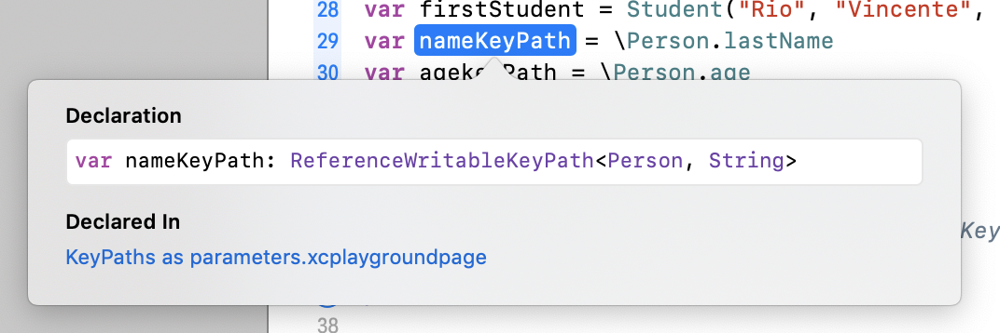

## Swift KeyPaths (1)

**KeyPaths** là khái niệm được đưa vào Swift từ version Swift 4 (source: [SE-0161](https://github.com/apple/swift-evolution/blob/master/proposals/0161-key-paths.md))

## Table of contents
- [KeyPaths basic](#keyPaths-basic)
- [KeyPaths store uninvoked reference to property](#keyPaths-store-uninvoked-reference-to-property)
- [KeyPaths as parameter](#keypaths-as-parameter)
- [Sort, filter...using KeyPaths](#sort,-filter...using-keyPaths)

## KeyPaths basic
- KeyPaths là cách để truy cập đến property chứ không phải truy cập đến giá trị của property.
- Khi định nghĩa KeyPaths thì ta hoàn toàn có thể xác định/định nghĩa được kiểu biến của KeyPaths
- Ở Objective C cũng đã có khái niệm KeyPaths, tuy nhiên KeyPaths của Objective C chỉ là string, còn KetPaths của Swift thì được định nghĩa rõ ràng kiểu dữ liệu

## KeyPaths store uninvoked reference to property
Cùng check đoạn code phía dưới
```Swift
class Person {
    var firstName: String
    var lastName: String
    var age: Int

    init(_ firstName: String, _ lastName: String, _ age: Int) {
        self.firstName = firstName
        self.lastName = lastName
        self.age = age
    }
}

var firstPerson: Person? = Person("Nhat", "Hoang", 10)

var nameKeyPaths = \Person.firstName
var refVar = firstPerson?.firstName

print("refVar value = \(refVar ?? "refVar nil")")
print("KeyPaths value = \(firstPerson?[keyPath: nameKeyPaths] ?? "nil")")

firstPerson = nil
print("refVar value = \(refVar ?? "refVar nil")")
print("KeyPaths value = \(firstPerson?[keyPath: nameKeyPaths] ?? "nil")")
```

Log
```
refVar value = Nhat
KeyPaths value = Nhat
refVar value = Nhat
KeyPaths value = nil
```

Với đoạn code trên, chúng ta dễ dàng thấy được sự khác nhau lớn giữa việc tham chiếu đến property của class khác nhau giữa việc sử dụng KeyPaths và bằng việc gán variable đến property của class.

- Với việc tham chiếu giá trị dùng cách gán variable đến property thì ta có thể thấy rằng, mặc dù `firstPerson` đã được gán bằng nil, tuy nhiên do khi gán `refVar` đến `firstName` cho nên sau khi `firstPerson` bị gán là nil thì `refVar` vẫn có giá trị vì phép gán này đã ảnh hưởng đến reference count của property.
- Đối với cách dùng KeyPaths, chúng ta vẫn có thể lấy được giá trị của property mặc cách bình thường, tuy nhiên KeyPaths không hề ảnh hưởng đến reference của property, do đó khi `firstPerson` được gán bằng nil, KeyPaths sẽ có value là nil.

Với sự khác biệt trên, chúng ta hết sức lưu ý khi sử dụng phương pháp tham chiếu (reference) đến giá trị của property nếu không rất dễ nẩy sinh bug.

## KeyPaths as parameter
Khi khai báo KeyPaths đến property nào đó của struct/class thì biến KeyPaths đó thể hiện rất rõ type của KeyPaths. Như ví dụ dưới, chúng ta có thể thấy rằng `nameKeyPath` là KeyPaths mô tả những property là kiểu `String` của type `Person`:


Nếu đơn thuần chỉ gán variable đến property của instance thì ta sẽ được kiểu biến là String (hoặc loại type tương ứng với property của instance) như ảnh dưới:


Vậy ứng dụng của việc này là gì?

Nếu ta có một logic nào đó chỉ chấp nhận đầu vào là property của một class/struct cho trước, thì chúng ta nên sử dụng KeyPaths để giới hạn kiểu parameters cho logic đó. Ví dụ:
```Swift
func printPersonName(_ person: Person, _ path: KeyPath<Person, String>) {
    print("Person name = \(person[keyPath: path])")
}

class Person {
    var firstName: String
    var lastName: String
    var age: Int

    init(_ firstName: String, _ lastName: String, _ age: Int) {
        self.firstName = firstName
        self.lastName = lastName
        self.age = age
    }
}
class Student: Person {
    var className: String

    init(_ firstName: String, _ lastName: String, _ age: Int, _ className: String) {
        self.className = className
        super.init(firstName, lastName, age)
    }
}

var firstPerson = Person("Nhat", "Hoang", 10)
var firstStudent = Student("Rio", "Vincente", 20, "Mẫu giáo lớn")
var nameKeyPath = \Person.lastName

printPersonName(firstPerson, nameKeyPath)
```

Với ví dụ trên thì func `printPersonName` chỉ chấp nhận đầu vào là `String` và thuộc class `Person`, nếu chúng ta sử dụng các KeyPaths cùng class Person nhưng khác kiểu data như `var agekeyPath = \Person.age` hoặc dùng KeyPaths cùng kiểu data nhưng khác class như `var studentNameKeyPath = \Student.lastName` (Student là class kế thừa Person) thì đều bị báo lỗi.

=> Điều này giúp chúng ta hạn chế sai sót ngay từ lúc coding.

## Sorted, filter...using KeyPaths
Một trong những ứng dụng rất hay của KeyPaths đó là làm cho các closure như `sorted`, `map`, `filter` trở nên linh hoạt hơn, và tính ứng dụng cao hơn.

Đi vào bài toán thực tế như sau:

Bạn được yêu cầu làm một ứng dụng dạng như app Contact, và ứng dụng này có 1 vài chức năng như là:
- Sắp xếp tên người dùng theo thứ tự
- Lọc ra những người dùng đủ 18 tuổi

Thì ta có thể triển khai như sau:
Khai báo class Person tương ứng với từng Contact:

```Swift
class Person {
    var firstName: String
    var lastName: String
    var age: Int
    var workingYear: Int

    init(_ firstName: String, _ lastName: String, _ age: Int) {
        self.firstName = firstName
        self.lastName = lastName
        self.age = age
        self.workingYear = 0
    }
}
```

Danh sách contacts:
```Swift
let listPersons: [Person] = [Person("Alex", "X", 1),
                             Person("Bosh", "Bucus", 12),
                             Person("David", "Lipis", 20),
                             Person("Why", "Always Me", 69),
                             Person("Granado", "Espada", 45),
                             Person("Granado", "Espada", 46)]
```
Bây giờ, nếu muốn sắp xếp danh sách người dùng theo thứ từ A->Z đối với first name, thì ta có thể làm đơn giản như sau:

```Swift
let sortedPersons = listPersons.sorted {
    $0.firstName < $1.firstName
}
```
Đây là cách làm không sai, tuy nhiên nếu như sau này có thêm các yêu cầu như: sắp xếp theo tứ tự first name Z->A, last name A->Z, last name Z->A, hoặc là sắp xếp theo quê quán, đất nước... thì có lẽ phải clone đoạn source code sort ra dài dài.

Trong trường hợp này, nếu sử dụng KeyPaths để implement logic sort, chúng ta có thể rút ngắn source code đi rất nhiều, và điều kiện sort cũng có thể tuỳ biến nhiều hơn.

Define enum thứ tự sort:
```Swift
enum Order {
    case ascending
    case descending
}
```
Override logic sort
```Swift
extension Sequence {
    func sorted<T: Comparable>(by keyPath: KeyPath<Element, T>, order: Order) -> [Element] {
        return sorted { a, b in
            switch order {
            case .ascending:
                return a[keyPath: keyPath] < b[keyPath: keyPath]
            case .descending:
                fallthrough
            default:
                return a[keyPath: keyPath] > b[keyPath: keyPath]
            }
        }
    }
}
```
Với cách làm sử dụng KeyPaths, thì ta có thể thoải mái sort listPersons dựa trên các điều kiện sort khác nhau như sort theo tên, theo họ, ascending hoặc descending...
Ví dụ: `var sortedPersons = listPersons.sorted(by: \.firstName, order: .descending)`

> Note: ở đây dùng extension của protocol `Sequence` vì `sorted` và `filter` thực chất là được define ở [Sequence protocol](https://developer.apple.com/documentation/swift/sequence)

Ví dụ về cách filter các điều kiện của list persons:
Xem trong file playground cuối bài.

Tài liệu có tham khảo:
- Swift's document
- nshipster.com
- hackingwithswift.com
- swiftbysundell.com

Trong phần tiếp theo, chúng ta sẽ đi vào một vài ứng dụng thực tế hơn sử dụng KeyPaths.

Sample playground: [Swift_KeyPaths.playground](https://github.com/RioV/swift.sample/tree/master/KeyPaths/Swift_KeyPaths.playground)
